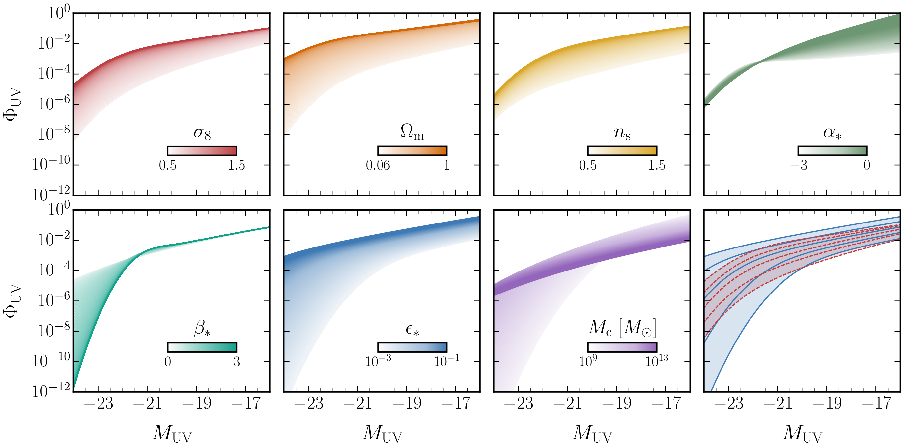

# GALLUMI: A Galaxy Luminosity Function Pipeline for Cosmology and Astrophysics

Authors: Nashwan Sabti, Julian Muñoz and Diego Blas

GALLUMI is a likelihood code that allows to extract cosmological and astrophysical parameters from the UV galaxy luminosity function. The code is implemented in the MCMC sampler [MontePython] and can be readily run in conjunction with other likelihood codes. Details of the code are provided in [2110.13161] and [2110.13168].

This GitHub page contains 1) the GALLUMI likelihood code, 2) scripts to generate mock data, and 3) script to create plots.

## Coming up

- A detailed manual and an automated script to move files
- A single likelihood file to run all simulations with
- Turn-over term in the luminosity function to account for inefficient galaxy formation in low-mass halos
- Option to use different window functions 

## Basic Usage of GALLUMI

- Download the [MontePython] MCMC sampler. 
- Move the contents of MontePython_files to the MontePython folder. 
    - MontePython_files/Bestfits, MontePython_files/Covmats and MontePython_files/Param_files go in the main MontePython folder
    - Create a new folder called "UVLF" in MontePython/data/ and move the contents of MontePython_files/Data/ in there
    - Move the contents of MontePython_files/Likelihoods/ to MontePython/montepython/likelihoods/
- Run the likelihood code with e.g. 
    ```sh 
    python2 montepython/MontePython.py run --conf default.conf --param Param_files/UVLF_HST_ST_model1.param --bestfit Bestfits/UVLF_HST_ST_model1.bestfit --covmat Covmats/UVLF_HST_ST_model1.covmat -f 0.5 --output UVLF_HST_ST_model1
    ``` 
## Example Plot
All plots in the papers [2110.13161] and [2110.13168] can be reproduced using the scripts provided in the Scripts/Plotting/ folder.



## Using GALLUMI in Publications
If you make use of the GALLUMI code in your publication, please cite the papers [2110.13161] and [2110.13168].
Chains are available upon request. 

## Contact
Please email nashwan.sabti@kcl.ac.uk for any questions :)


[MontePython]: <https://github.com/brinckmann/montepython_public>
[2110.13161]: https://arxiv.org/abs/2110.13161
[2110.13168]: https://arxiv.org/abs/2110.13168
